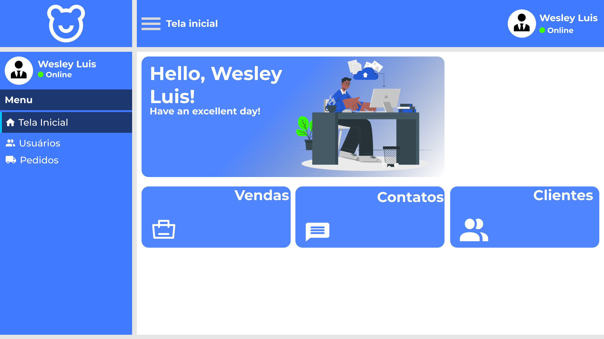

# Projeto desenvolvido para nosso TCC na ETEC no curso de Desenvolvimento de Sistemas.

Projeto construído durante o 2/3° módulo do curso de DS.

> DESIGN

* Figma

> FRONTEND

## 🔨 TECNOLOGIAS

* NodeJS
* GIT & GITHUB
* JavaScript
* React JS

## Tela de LOGIN

## Tela da HOME

## Tela da Dashboard

